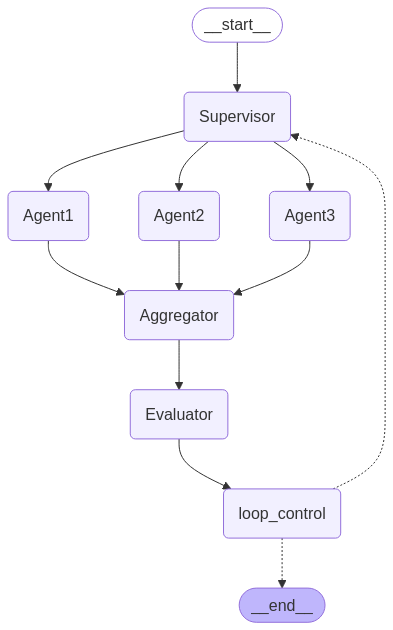

### Resume Tailoring Through feedback loop

The project aims to tailor the resume based on the job descrition and an initial resume by using a feedback loop to increase relevancy score.

## Working

-   Use 3 `Agent` to create different tailored resumes focusing on Impact, Skills and Industry respectively.
-   An `Aggregator` Agent combines these resumes by adding best features from each resume and creating a final resume.
-   This resume is evaluated by the `Evaluator` Agent which gives the resume a relevancy score.
-   The loop ends when:
    -   Relevancy Score > 90
    -   Max iterations reached

## Agent Graph

Agent architecture for the different agents.

### THANK YOU
